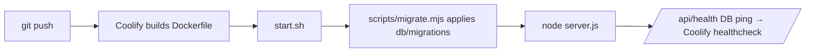

# Internship Coordination App — Implementation Plan

## STATUS: implementation complete — remaining work is publishing

All 8 build steps are implemented and committed on branch
`feat/intern-management-app` (7 commits on top of `Initial commit`):
foundation/schema/seed, auth+shell, reference data, students, capacity+planning,
dashboard, Excel import/export, deploy artifacts + README runbook + tests.

**Nothing has been pushed yet.** What remains:

1. **Point `origin` at the SSH URL** the user specified:
   `git remote set-url origin git@github.com:pimwillems/internship-manager.git`
   (`origin` currently points at the HTTPS form of the same repo.)
2. **Push `main` first.** `git ls-remote origin` returns **zero branches** — the
   GitHub repo is empty, so there is no base branch for a PR to target. Push
   local `main` with `git push -u origin main` so it becomes the default branch.
3. **Push the feature branch:** `git push -u origin feat/intern-management-app`.
4. **Open the PR** `feat/intern-management-app` → `main`. `gh` is **not
   installed** in this container, so use the GitHub REST API:
   `POST /repos/pimwillems/internship-manager/pulls` via `curl` with a token.
   Title: "Internship coordination app". Body: what the app does, the capacity
   rule, the three reference-data workflows, and that Coolify deployment is
   documented-not-performed.

**Known risks to handle when executing, not to block on:**
- *SSH auth:* pushing over `git@github.com:` needs an SSH key this container may
  not have, and the agent proxy may rewrite git SSH. If SSH fails, fall back to
  the HTTPS remote (same repo) and report which was used.
- *PR credentials:* if no GitHub token is available, push the branches (the
  valuable, recoverable part) and report that the PR must be opened from the
  GitHub UI, giving the compare URL
  `https://github.com/pimwillems/internship-manager/compare/main...feat/intern-management-app`.
- Retry pushes up to 4 times with exponential backoff on network errors only.

Everything below is the original plan, kept as the record of what was built.

---

## Context

The internship semester coordinator runs the entire semester out of one large Excel workbook:
student details, whether each student has an approved internship, the company, a short assignment
description, a free-text remarks column, plus a separate list of assessors, their teams, and which
team owns which semester topic. Every student needs a **1st assessor** (also their coach) and a
**2nd assessor**. Each assessor has an **individual maximum** number of students they will take as
1st assessor (2, 1, 3, …). Keeping that cap consistent by hand is where the spreadsheet breaks down.

The goal is a web app that fully replaces the workbook, driven entirely from a GUI (no hand-written
SQL, no terminal for day-to-day use), runnable locally first, then deployed to a Hetzner server
running Coolify. The build is greenfield: `/home/user/repo` (local: `~/git/work/intern-management`)
contains only `.git`. This container runs Node 22.22 / bun 1.3.11 / Docker 29.3 — sufficient.

All package versions in the stack are verified against npm as of today and are current:
`next@16.2.11`, `react@19.2.8`, `drizzle-orm@0.45.2`, `drizzle-kit@0.31.10`, `better-auth@1.6.25`,
`@tanstack/react-table@8.21.3`, `tailwindcss@4.3.3`, `zod@4.4.3`, `xlsx@0.18.5`, `postgres@3.4.9`.

## Decisions (confirmed)

| Topic | Decision |
|---|---|
| Stack | Next.js 16 (App Router, Server Actions, TS) + Postgres 17 + Drizzle + shadcn/ui |
| Assignment | Manual picking; **hard** transactional validation on the 1st-assessor maximum |
| Team ↔ topic | **Soft preference** — matching assessors sort to top; mismatch warns, never blocks |
| 2nd assessor cap | **None** — load shown as a number only |
| Semesters | **Multiple cohorts**, switchable via cookie; past ones stay browsable |
| Topics | **Reusable catalog** (small manual list), each topic assigned to one owning team; not semester-scoped. Real list seeded from the coordinator's per-team list |
| Assessors | **Team fixed** per assessor; **availability + max are per semester** (an assessor is available in a semester iff they have an `assessor_capacity` row for it) |
| Approval vs assignment | Assessors may be assigned before approval; dashboard **flags** those students |
| Auth | Single coordinator; **env-seeded on first run**; Better Auth owns auth tables |
| Excel | One-time guided import + ongoing export; **SheetJS `xlsx@0.18.5`** (pinned) |

## Reference-data workflows (first-class — all GUI, no terminal)

These three must be obvious and complete in the app; they are the backbone of everything else:

1. **Assessors change per semester.** `/assessors` lets the coordinator create / edit / deactivate
   assessors and assign each to **one team** (fixed). Each assessor's **availability and 1st-assessor
   max is set per active semester** — availability = the presence of an `assessor_capacity` row for
   that `(assessor, semester)`. So when a new semester starts, the coordinator picks who participates
   this time and their cap, without touching prior semesters. Assessors with no capacity row for the
   active semester simply don't appear as assignable that semester.
2. **Topics belong to teams.** `/settings/topics` manages the reusable topic catalog: add/rename a
   topic and assign it to its **owning team** (`/settings/teams` manages the teams themselves). This
   is "which team manages which topic."
3. **Student → topic → owning team.** On the student detail form the coordinator picks the student's
   **semester topic** from the catalog. That topic's owning team is what drives the **soft
   preference** in the assessor combobox: assessors on the topic's owning team sort to the top and
   are labelled; off-team assessors are still selectable with a warning. So topic ownership and
   assessor team assignment connect here — pick the topic, and the right assessors float up.

**Real teams + topic catalog to seed** (each topic owned by the listed team; students pick one topic):

```
Team 1  →  AI Machine Learning & Data
           Applied Generative AI
           Business IT & Data Analysis
Team 2  →  FED
           FSD
Team 3  →  Cyber Security Essentials
           Network & Cloud Automation
           Intelligent Devices
Team 4  →  Game Design
           Open Learning
           Mobile Apps Development
```

These 4 teams and 11 topics are seeded via `scripts/seed.ts` at step 1 and are editable in
`/settings`. Assessors and students remain dev placeholders until the real Excel import (step 7).

## Refinements to the draft (folded in below, with rationale)

1. **Better Auth owns its own tables.** Do **not** hand-roll a `users` table with `password_hash` —
   it conflicts with Better Auth's generated `user` / `session` / `account` / `verification` schema.
   Instead: Better Auth (Drizzle adapter, postgres) owns those tables; add a `role`
   (`coordinator | viewer`) via `user.additionalFields`; app FKs (`audit_log.user_id`) reference
   Better Auth's `user.id`. This still "allows more users later" — it's a UI change, not a rewrite.
2. **Migrations run programmatically at container start,** via `migrate()` from
   `drizzle-orm/postgres-js/migrator`, not the `drizzle-kit` CLI. `drizzle-orm` is a prod dependency
   already present in the Next standalone image; `drizzle-kit` stays a dev-only tool (used for
   `generate`). This keeps the production image lean and needs only the committed `db/migrations/`
   folder at runtime.
3. **Env-seeded coordinator.** A one-time seed step creates the account from `COORDINATOR_EMAIL` +
   `COORDINATOR_PASSWORD` via Better Auth's server API (so hashing/format is Better Auth's, not a
   raw insert) if no user exists. No public signup route. Password is changeable in `/settings`.
4. **SheetJS pinned** to `xlsx@0.18.5`. Import input is the coordinator's own trusted workbook, so
   the known prototype-pollution advisory (untrusted-input) does not meaningfully apply.

## Stack

- **Next.js 16** — App Router, React 19, Server Actions, TypeScript end to end, `output: 'standalone'`.
- **PostgreSQL 17** — Coolify-managed service in prod; local Docker container in dev.
- **Drizzle ORM 0.45 + drizzle-kit 0.31** — schema in TS, versioned SQL in `db/migrations/` committed
  to git; applied on container start via the programmatic migrator (refinement #2).
- **shadcn/ui + Tailwind CSS 4** — table, dialog, form, combobox, badge, toast, progress primitives.
- **TanStack Table 8** — sorting/filtering/column-visibility on the student and assessor grids.
- **Zod 4** — one schema per form, shared by client validation and the server action.
- **Better Auth 1.6** — email+password session for the coordinator; owns its Postgres tables (#1).
- **SheetJS `xlsx@0.18.5`** — import parsing + export generation.
- **postgres 3.4 (postgres.js)** — pooled driver behind Drizzle; supports `.transaction()` and
  `SELECT … FOR UPDATE` row locks needed for the capacity rule.

Drizzle Studio (`npx drizzle-kit studio`) is the dev-only GUI over raw data for rare inspection.

## Data model (`db/schema.ts`)

```
-- owned by Better Auth (generated, do not hand-author columns beyond additionalFields):
user             id, email, name, emailVerified, image, role (coordinator|viewer), createdAt, updatedAt
session, account, verification   (Better Auth standard)

-- app tables:
semesters         id, name ("2026-2027 S1"), starts_on, ends_on, is_active
teams             id, name
topics            id, name, team_id → teams          -- reusable catalog; team_id = owning team
assessors         id, name, email, team_id → teams, is_active   -- team fixed per assessor
assessor_capacity id, assessor_id → assessors, semester_id → semesters, max_as_first
                  -- one row per (assessor, semester) the assessor participates in;
                  -- row existence = "available this semester", max_as_first = their cap
students          id, semester_id → semesters, student_number, first_name, last_name, email,
                  topic_id → topics,
                  internship_status (enum: none | pending | approved | rejected),
                  company, assignment_description, remarks,
                  first_assessor_id → assessors, second_assessor_id → assessors
audit_log         id, user_id → user.id, entity, entity_id, action, changes(jsonb), created_at
```

DB-level constraints (not just UI):
- unique `(semester_id, student_number)` on `students`
- unique `(assessor_id, semester_id)` on `assessor_capacity`
- `CHECK (first_assessor_id IS DISTINCT FROM second_assessor_id)` — nobody is both on one student
- FKs to `assessors` use `ON DELETE RESTRICT` — an assessor holding students can't be deleted
- topics/students FKs to reference tables `RESTRICT`; `audit_log.user_id` `ON DELETE SET NULL`

**Capacity rule (the critical path).** Enforced in a server action inside `db.transaction()`:
lock the `assessor_capacity` row for `(assessor_id, semester_id)` with `.for('update')`, count
current 1st-assessor students for that assessor in that semester, compare to `max_as_first`, reject
with a readable error if the assignment would exceed it. Missing capacity row ⇒ treat as unset and
block with "no capacity configured for this semester". The row lock makes it correct under
concurrent tabs. **`lib/capacity.ts` is the single source of truth** — the combobox, student form
action, planning board, and import validator all call it; no second implementation.

## Screens (unchanged from draft — summarized)

- **`/` Dashboard** — per active semester: totals, approved count, fully-assigned, missing 1st/2nd.
  Two attention lists: assigned-but-not-approved (the flag), and approved-but-unassigned.
- **`/students`** — TanStack Table over the active semester; filters (status/topic/assigned), search,
  inline edit for status + remarks, click-through to detail sheet, **Export to `.xlsx`** button.
- **`/students/[id]`** — full form incl. **topic picker** (from the catalog; its owning team drives
  the soft preference) + capacity-aware assessor combobox (`3 / 4 as 1st` badges, assessors on the
  topic's owning team sorted to top and labelled, at-max assessors shown but disabled, off-team
  allowed with inline warning). Combobox only lists assessors available in the active semester.
- **`/assessors`** — create/edit/deactivate assessors and assign each to a team; table shows team,
  **this-semester availability toggle + max as 1st**, 1st-load (progress bar), 2nd-load (number);
  expand a row to see held students. Setting a max here creates/updates the `assessor_capacity` row
  for the active semester (removing it marks the assessor unavailable this semester).
- **`/planning`** — capacity board: every assessor a row with remaining 1st capacity, unassigned
  students in a side panel assignable in place, total-remaining-vs-still-needed headline number.
- **`/settings`** — semesters (create/set active); teams (CRUD); **topics catalog** (add/rename +
  assign owning team); coordinator password. This is where the topic-per-team list is maintained.
- **`/import`** — upload `.xlsx` → pick sheet → map columns (remembered default) → preview with
  per-row validation → commit in one transaction; unknown assessors/teams offered for creation inline.

## Files to create

```
db/schema.ts                     Drizzle tables (app) + Better Auth table refs
db/index.ts                      pooled postgres.js client + drizzle instance
db/migrations/                   generated SQL, committed
drizzle.config.ts
scripts/migrate.mjs              programmatic drizzle-orm migrator (runs at container start)
scripts/seed.ts                  dev seed: teams/topics/assessors/students + capacities
scripts/seed-coordinator.ts      env-seeded Better Auth account (idempotent)

lib/auth.ts                      Better Auth server config (Drizzle adapter, role additionalField)
lib/auth-client.ts               Better Auth React client
lib/capacity.ts                  capacityFor(assessorId, semesterId), assertCanAssignFirst(tx,…)
lib/audit.ts                     withAudit() wrapper around mutating actions
lib/semester.ts                  active-semester resolution from cookie, shared by all pages
lib/db.ts                        re-export of db + transaction helper
lib/excel/import.ts              parse + per-row validate (calls lib/capacity for cap checks)
lib/excel/export.ts             build workbook from students

app/(auth)/login/page.tsx
app/(app)/layout.tsx             protected shell: sidebar nav + semester switcher
app/(app)/page.tsx               dashboard
app/(app)/students/{page.tsx,[id]/page.tsx,actions.ts}
app/(app)/assessors/{page.tsx,actions.ts}
app/(app)/planning/page.tsx
app/(app)/settings/{semesters,teams,topics,account}/… + actions.ts
app/(app)/import/{page.tsx,actions.ts}
app/api/auth/[...all]/route.ts   Better Auth handler
app/api/health/route.ts          trivial DB query for Coolify healthcheck
middleware.ts                    redirect unauthenticated → /login

components/ui/…                   shadcn primitives
components/assessor-combobox.tsx  capacity-aware picker (student detail + planning board)
components/semester-switcher.tsx
components/students-table.tsx, assessors-table.tsx

Dockerfile                       multi-stage, Next standalone; runtime = migrate then server.js
docker-compose.yml               local dev: postgres:17 + adminer
scripts/start.sh                 node scripts/migrate.mjs && node server.js
.env.example                     DATABASE_URL, BETTER_AUTH_SECRET, BETTER_AUTH_URL,
                                 COORDINATOR_EMAIL, COORDINATOR_PASSWORD
README.md                        local setup + Coolify deploy steps
```

## Shape of the capacity rule (single source of truth)

```mermaid
flowchart TD
    subgraph callers[all read remaining capacity from lib/capacity.ts]
      C1[assessor-combobox.tsx]
      C2[students/[id] actions.ts]
      C3[planning/page.tsx]
      C4[excel/import.ts validator]
    end
    C1 & C3 --> READ[capacityFor assessorId, semesterId → used / max]
    C2 & C4 --> WRITE[assertCanAssignFirst inside db.transaction]
    WRITE --> LOCK[lock assessor_capacity row .for update]
    LOCK --> COUNT[count 1st-assessor students in semester]
    COUNT --> CMP{used + 1 &le; max_as_first?}
    CMP -- no --> ERR[throw readable error]
    CMP -- yes --> OK[write first_assessor_id + audit_log]
```

## Deploy path (schema change = git push, no terminal)



## Build sequence

Steps 1–2 are sequential (everything builds on schema + shell). Steps 3–7 are largely independent
once 2 exists.

1. **Foundation** — scaffold Next 16 + TS + Tailwind 4 + shadcn init; `docker-compose.yml` (postgres:17
   + adminer); `drizzle.config.ts`; `db/schema.ts` first migration; `scripts/seed.ts` seeding the
   **real 4 teams + 11 topics above** plus a few placeholder assessors/students for dev;
   `scripts/migrate.mjs`.
2. **Auth + shell** — `lib/auth.ts` (Better Auth + Drizzle adapter, role field), `/api/auth` handler,
   `login` page, `middleware.ts` guard, protected `(app)/layout.tsx` with sidebar + semester switcher,
   `lib/semester.ts` cookie resolution, `scripts/seed-coordinator.ts`.
3. **Reference data (the three workflows)** — `/settings` for semesters, teams, and the topic
   catalog with owning-team assignment (seed the coordinator's real topics-per-team list here);
   `/assessors` CRUD with team assignment and per-semester availability/max (capacity rows).
4. **Students** — table, filters, detail form, CRUD server actions, `lib/audit.ts` wired into mutations.
5. **Assignment + capacity** — `lib/capacity.ts`, `assessor-combobox.tsx`, transactional validation,
   `/planning` board.
6. **Dashboard + flags** — stats and the two attention lists.
7. **Excel** — `lib/excel/import.ts` + `/import` wizard, `lib/excel/export.ts` + export button; run
   against the real workbook (confirm exact columns then, adding a small migration for any extras).
8. **Deploy artifacts + runbook (no live deploy)** — produce `Dockerfile` (multi-stage, standalone),
   `scripts/start.sh`, `/api/health`, and a **step-by-step Coolify runbook in `README.md`** the
   coordinator follows themselves. I do **not** perform the actual Coolify deployment — deliverables
   are the working artifacts plus written instructions, verified by building the image locally.

## Deployment to Coolify — instructions only (I don't run it)

The plan produces everything needed to deploy, plus a **README runbook** the coordinator executes.
I will **not** perform the deployment. The runbook covers, as numbered steps: create a Coolify
project → add a **PostgreSQL** service (enable scheduled backups to local disk or S3) → add the
**app** from the Git repo (Dockerfile build) → set env vars `DATABASE_URL` (internal Postgres
hostname), `BETTER_AUTH_SECRET`, `BETTER_AUTH_URL`, `COORDINATOR_EMAIL`, `COORDINATOR_PASSWORD` →
attach the domain (Coolify handles Let's Encrypt) → point the healthcheck at `/api/health` → deploy
→ confirm migrations ran in the deployment log and first login works. `start.sh` migrates before
serving; rollback is Coolify's previous-deployment button; `/api/health` does a trivial DB query so
the healthcheck fails loudly if Postgres is unreachable. Design intent: a schema change ships with a
plain `git push` — no terminal on the server.

## Verification

- **Boot:** `docker compose up -d && npm run db:migrate && npm run db:seed && npm run dev` → app at
  `localhost:3000`, login with seeded coordinator works.
- **Capacity (critical):** assessor with `max_as_first = 2`, assign two students → combobox shows
  them disabled at `2 / 2` for a third; a forged server-action request bypassing the UI is still
  rejected; raising max to 3 in settings makes them selectable with no restart.
- **Concurrency:** two tabs assigning the same last slot → one succeeds, one gets a clear error,
  DB never exceeds the max (row-lock proof).
- **Soft team rule:** assign an off-team assessor → saves + shows the warning.
- **Flagging:** student with both assessors + status `pending` appears in the dashboard attention
  list; disappears once `approved`.
- **Semesters:** second semester → capacity counts reset per semester; first semester's data intact
  when switched back.
- **Excel round-trip:** import the real workbook, spot-check ~10 rows, export and diff against source.
- **Automated:** unit tests on `lib/capacity.ts` + the import parser; Playwright run covering
  login → create student → assign assessors → hit the cap (Chromium is pre-installed at
  `/opt/pw-browsers`; do not run `playwright install`).
- **Deploy artifacts (no live deploy):** `docker build` the production image locally and run it
  against a Postgres container to confirm `start.sh` applies migrations then serves, and
  `/api/health` returns OK. The live Coolify deploy is done by the coordinator following the README
  runbook — verified by them, not in this session.

## Open item to confirm during build

Student columns are modelled from the description (number, name, email, topic, status, company,
assignment description, remarks). When the real `.xlsx` is available at step 7, any extra columns get
a small migration before the import runs.
